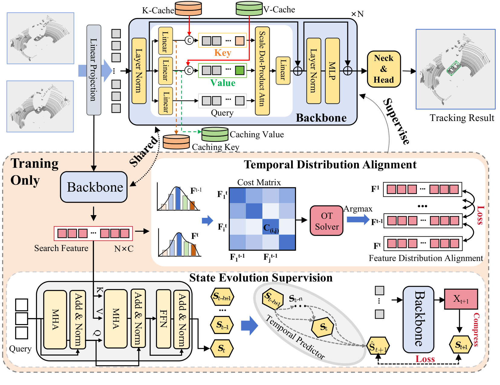

# TETrack3D: State Evolution Awareness for Category-agnostic 3D Point Cloud Tracking (NeurIPS 2026)

## Introduction

TETrack3D is a category-agnostic framework for 3D single-object tracking. It maintains temporal key-value caches in the backbone to preserve target information across frames and explicitly models how target states evolve over time. During training, state evolution supervision learns temporal state transitions, while temporal distribution alignment encourages consistent feature distributions across adjacent frames. These training-only objectives strengthen temporal modeling without adding the corresponding supervision modules to inference. We evaluate TETrack3D on KITTI, nuScenes, and Waymo under category-agnostic and cross-dataset settings.



Please refer to the [Paper]() for more details.

## 🔧 Environment setup

Create the Conda environment from the provided [`environment.yml`](environment.yml). This is the required environment specification for this repository; no separate `pip install` step is needed.

```bash
cd /share/hxt/tracking/some_try/3d_my/eccv/ours
conda env create -f /share/hxt/tracking/some_try/3d_my/eccv/ours/environment.yml
conda activate 3dtracktorch2_224_mamba_test
```

The environment includes Python 3.10, PyTorch 2.1.2, CUDA 11.8, PyTorch3D 0.7.8, PyTorch Lightning 2.1.0, and Mamba-SSM 1.2.0.post1. An NVIDIA driver compatible with CUDA 11.8 is required.

To update an existing environment from the same file, run:

```bash
conda env update \
  -n 3dtracktorch2_224_mamba_test \
  -f /share/hxt/tracking/some_try/3d_my/eccv/ours/environment.yml \
  --prune
```

## 💾 Dataset preparation

Dataset roots can be set in the corresponding file under `configs/` or overridden at runtime with `--data-root`.

### KITTI

Set the data root to the KITTI `training` directory:

```text
KITTI/training/
├── calib/
├── label_02/
└── velodyne/
```

### nuScenes

Set the data root to the directory containing both the metadata and point-cloud folders:

```text
nuScenes/
├── v1.0-trainval/
├── samples/
├── sweeps/
└── maps/
```

### Waymo

The Waymo adapter expects the preprocessed tracking benchmark layout below:

```text
Waymo/
├── benchmark/validation/vehicle/
│   ├── bench_list.json
│   ├── easy.json
│   ├── medium.json
│   └── hard.json
├── gt_info/
└── pc/raw_pc/
```

Waymo is evaluation-only. The reported Waymo setting directly evaluates the KITTI-trained model without Waymo fine-tuning.

## 📦 Checkpoints

Download the released TETrack3D checkpoints from [Google Drive](https://drive.google.com/drive/folders/1MQbxJXfzGvKflySuFNo34vgXj8mOjwPG?usp=drive_link), then place them in the `weights/` directory:

| Dataset | Checkpoint | Usage |
| ------- | ---------- | ----- |
| **KITTI** | `weights/tetrack3d_kitti.ckpt` | KITTI evaluation |
| **nuScenes** | `weights/tetrack3d_nuscenes.ckpt` | nuScenes evaluation |
| **Waymo** | `weights/tetrack3d_waymo.ckpt` | KITTI-to-Waymo evaluation |

The Waymo checkpoint contains the same model weights as the KITTI checkpoint because the Waymo experiment uses direct cross-dataset evaluation.

Fresh training additionally requires the pretrained RECON encoder [`base_model.pth`](https://drive.google.com/file/d/1zEc9w5AdeiW55yWVUC4zuEQ2tu0xtJfA/view?usp=drive_link). Download the file, then set its local path through `model.pretrained_backbone` in the selected configuration or the `--pretrained-backbone` option.

## 📊 Evaluation

Run the following command from the repository root after activating the Conda environment. Replace `<dataset>` with `kitti`, `nuscenes`, or `waymo`, and set the corresponding dataset root.

```bash
python test.py configs/tetrack3d_<dataset>.yaml \
  --data-root /path/to/<dataset> \
  --checkpoint weights/tetrack3d_<dataset>.ckpt \
  --device cuda:0 \
  --output-dir outputs/<dataset>_test
```

Evaluation writes the aggregate metrics to `test_summary.json` and the run metadata to `evaluation.json`. Add `--save-predictions` to export predicted boxes. For a quick pipeline check, add `--debug --max-tracklets 2`.

## ⚙️ Training

Training is supported on KITTI and nuScenes. Replace `<dataset>` with `kitti` or `nuscenes`. A fresh run must initialize the backbone from a pretrained RECON checkpoint.

```bash
python train.py configs/tetrack3d_<dataset>.yaml \
  --data-root /path/to/<dataset> \
  --pretrained-backbone /path/to/base_model.pth \
  --devices 0,1,2,3 \
  --output-dir outputs/<dataset>_train
```

The command-line `--pretrained-backbone` value overrides `model.pretrained_backbone` in the YAML configuration. It initializes only the RECON backbone, not the localization or state-evolution modules.

Resume an interrupted run with:

```bash
python train.py configs/tetrack3d_<dataset>.yaml \
  --data-root /path/to/<dataset> \
  --resume /path/to/last.ckpt \
  --devices 0,1,2,3 \
  --output-dir outputs/<dataset>_train
```

Add `--debug` to limit training and validation to two batches for a quick wiring check.

<!--
## 📚 Citation

If this repository is useful for your research, please cite the NeurIPS 2026 paper:

```text
State Evolution Awareness for Category-agnostic 3D Point Cloud Tracking.
Advances in Neural Information Processing Systems (NeurIPS), 2026.
```

The complete BibTeX entry will be added with the public paper metadata.
-->
